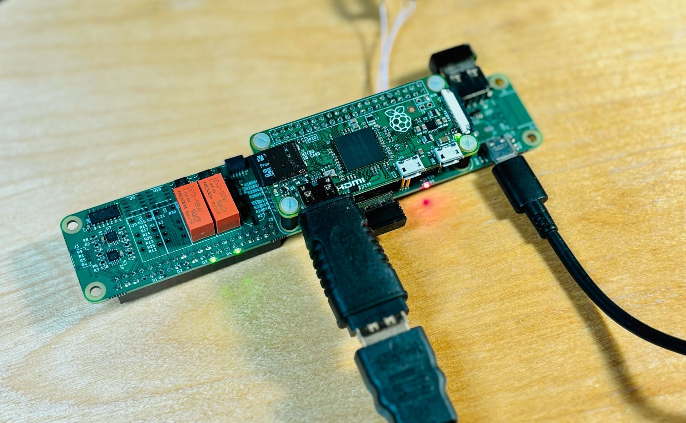

**Pinbot** is an open-source platform for quickly building test jigs for electronics QA. The platform is made up of mechanical fixtures, control electronics, jig-level software and backend to store all test results.

**This repo is in active development. New HW will be released soon.**

## Pinbot Hardware
This repo is dedicated for electronics of a typical Pinbot jig. Now it is a compact carrier board for Raspberry Pi 0.

**It features:**
- 8 channels ADC 0-24V
- 8 channels GPIO 0-24V
- 4 signal relays
- USB hub (4x, with power control)
- Qwiic connector for I2C
- USB-C for power supply

Carrier board is 150x30mm. Repo includes KiCAD source files, generated gerbers, BOM, and everything to produce it on your own.